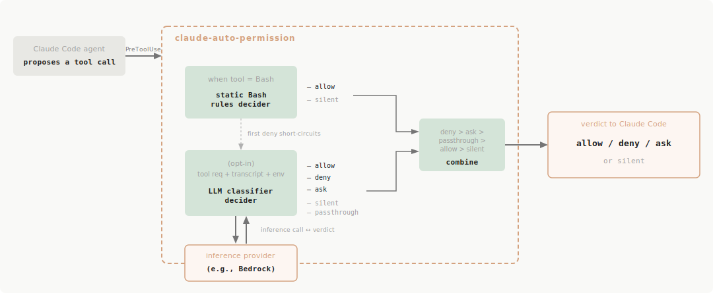

# Claude Auto Permission 

[](https://github.com/kevinhwang/claude-auto-permission/actions/workflows/ci.yml)

A [Claude Code hook](https://code.claude.com/docs/en/hooks-guide) for automating Claude
Code permission decisions for truly autonomous agent work. No more babysitting Claude and answering permission prompts
every ten seconds — give your agents long-horizon work and let them work while you sleep!


It provides:

1. A **Bash tool layer** with a richer matching model than Claude Code's own
  [fine-grained permissions](https://code.claude.com/docs/en/permissions), whose prefix patterns can't reason about
  loops, subshells, command substitution, or whether a command is actually safe rather than merely allowlisted.
2. An **"[auto mode](https://code.claude.com/docs/en/permission-modes#eliminate-prompts-with-auto-mode)"
  reimplementation** (the official version isn't available when using third-party inference) that lets a
  classifier model auto-approve or deny tool requests based on whether they're 1) not dangerous and 2) aligned with
  your stated intent in the conversation.
  - This classifier is very powerful and can dynamically block bad actions that other permission layers would've allowed.


## Motivation

Claude Code's default permission system is conservative even after you've configured a comprehensive allowlist. Its
rules are prefix/glob patterns — great for *"is this an allowlisted command,"* useless for *"is this safe."* Anything
structural — a `for` loop, a subshell, command substitution like `git diff $(git merge-base HEAD main)`, a multi-line
script — falls back to a prompt, and so does any command that isn't allowlisted. The result is permission fatigue:
dozens of *"Allow?"* dialogs per session for commands that are obviously safe.

Common reactions, both bad:

- Run with `--dangerously-skip-permissions` and hope nothing goes wrong.
- Develop muscle memory for clicking **Allow** on every prompt without reading it — same outcome, more friction.

This tool is a middle path. It auto-approves the safe stuff so you don't have to, while still routing genuinely
ambiguous calls through a human (or, optionally, an LLM judge) before they fire.

## Not A Security Tool ‼️

This tool is **not** a security boundary. Technically it may make Claude Code slightly *less* safe — it loosens the
harness in exchange for autonomy and reduced friction.

Versus the common alternatives — `--dangerously-skip-permissions`, or instinct-clicking **Allow** on every
prompt — it's still a substantial improvement. But it can't catch every edge case. `npm install` looks innocuous (a
human would approve it too), yet a malicious dependency can run arbitrary code the hook won't catch. Even with
the classifier on, it misses a real fraction of overeager actions (Anthropic reports ~17% false-negative for
official Auto Mode) — it's no substitute for careful human review on high-stakes infrastructure.

The threat model is an honest Claude that occasionally makes mistakes. On indirect prompt injection, note what is and
isn't hardened: transcript stripping insulates the *classifier* (it never sees tool outputs), but the *agent* still
reads them and can be hijacked. Lacking a prompt-injection probe (see the classifier design doc), the classifier catches
only injection that steers the agent into an action it independently judges unsafe. Use accordingly.

## How It Works

claude-auto-permission registers as a [**PreToolUse** hook](https://code.claude.com/docs/en/hooks-guide). Claude calls
it before every tool invocation; the hook decides allow / deny / no-opinion and returns the verdict to the harness.



Two independent layers vote on each call. The layers run in parallel conceptually — a permissive vote from one **does
not** short-circuit the other, so a later veto can always override an earlier allow. A `deny` always wins.

### Static Bash Rules

Claude Code's native Bash permission model is roughly `Bash(command subcommand:*)` — flat prefix patterns. Multi-line
scripts, conditionals, loops, subshells, and command substitution all fall back to a prompt.

This layer parses each Bash command into a full Bash AST and walks every node — each statement in a compound chain,
each side of a pipe, the condition and body of `if`/`for`/`while`/`case` blocks, the contents of subshells and command
substitutions, redirects, the lot. Each command node is checked against a config-driven rule set with a rich DSL:
subcommand allowlists, flag matchers (exact, pattern, presence/absence), per-positional checks (e.g. write-path
gating), nested rule references for things like `ssh host -- <inner-command>` (recursively evaluated under the host's
own write scope), and more. The bundled defaults cover ~80 common dev tools out of the box.

When every node clears the rule set, the layer votes `allow`. Otherwise, it stays silent and falls through to Claude
Code's normal permission flow. It never blocks.

See [`docs/static-bash-rules-design.md`](docs/static-bash-rules-design.md) for the full design.

### "Auto Mode" Classifier

This feature is inspired by Claude Code's own
[Auto Mode](https://www.anthropic.com/engineering/claude-code-auto-mode) — an Anthropic classifier that
reads the session transcript plus the proposed tool call and decides whether the action should fire.
Unfortunately, at time of writing Claude Auto Mode is only available on first-party Anthropic inference, so users
running against Amazon Bedrock, Google Cloud Vertex, etc. don't have access. This classifier is a local reimplementation
of Auto Mode's transcript-classifier layer, giving an "auto mode" for the rest of us.

One deliberate omission: Anthropic's server-side prompt-injection probe runs inside their inference path and isn't
something we replicate from a hook today. See [Follow-Ups](docs/llm-classifier-design.md#follow-ups).

The classifier covers all Claude Code tools (`Read`, `Write`, `Edit`, `Bash`, `WebFetch`, `Agent`, MCP servers, …),
not just Bash. Unlike the static layer, it's not constrained to syntactic pattern matching against a fixed list of
rules — it can approve arbitrary actions aligned with your stated intent and deny dangerous ones, obfuscation
attempts, or agent over-eagerness beyond the scope of what you asked for.


This feature is **disabled by default** and must be opted into per project by configuring an inference provider (only
Bedrock today). Extra-cautious users can run it in a block-only mode where it only ever denies — keeping the
transcript-aware veto without ever ceding auto-approval to the model. See [`GETTING_STARTED.md`](GETTING_STARTED.md)
for setup details.

See [`docs/llm-classifier-design.md`](docs/llm-classifier-design.md) for the full design.

## Getting Started

```shell
make install-hook
```

For setup details — prerequisites, manual install, hook registration, configuration, and debugging — see
[`GETTING_STARTED.md`](GETTING_STARTED.md).

## Documentation

- [`GETTING_STARTED.md`](GETTING_STARTED.md) — install, configure, debug.
- [`DEVELOPMENT.md`](DEVELOPMENT.md) — building, testing, contributing.
- [`docs/design.md`](docs/design.md) — overall hook architecture, decision pipeline, caching, concurrency, logging.
- [`docs/static-bash-rules-design.md`](docs/static-bash-rules-design.md) — design of the Bash AST walker and rule DSL.
- [`docs/llm-classifier-design.md`](docs/llm-classifier-design.md) — design of the classifier subsystem.
- [`docs/code-architecture.md`](docs/code-architecture.md) — package-level map of the codebase.
