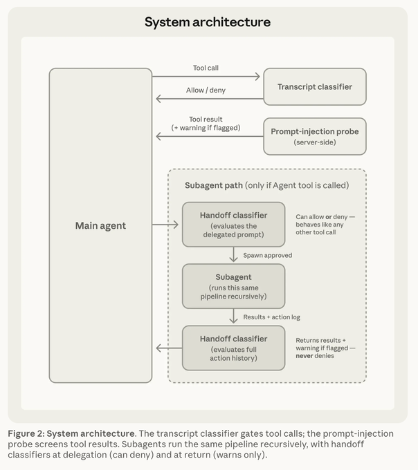
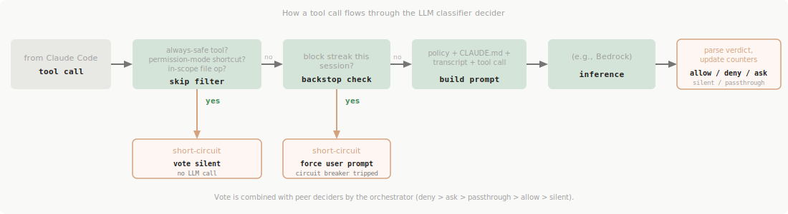

# LLM Classifier Design

This document describes the design of the LLM-based classifier — one of two decisioning subsystems in the
claude-auto-permission hook. For the orchestrator that combines this subsystem's verdict with peer subsystems', see
[`design.md`](design.md). For the static Bash layer, see [`static-bash-rules-design.md`](static-bash-rules-design.md).

## Context

### Motivation

claude-auto-permission's static Bash layer auto-approves a large fraction of routine shell calls — `git status`, `cat
README.md`, `npm test` — without an LLM round-trip. That handles the easy 80%, but it leaves a long tail of ambiguous
calls that the static layer, by design, cannot prove safe:

- Bash commands the AST walker doesn't recognize, or that pass syntactic checks but cross a semantic boundary the user
  set ("don't push to main").
- File writes outside the configured allowed directories.
- `WebFetch` calls to unfamiliar hosts.
- MCP tool invocations against external services.
- `Agent` (subagent) spawns whose effect depends on the prompt the parent agent constructed.

The static layer can't reason about these. The user's options without a classifier reduce to: configure a coarse
allow-list (with the false-positive risk of approving things the user didn't actually intend in this session), or
manually approve every call (back to permission fatigue).

The classifier is the layer that closes the gap. It judges each ambiguous call against the running session transcript
and a configured policy, blocking what looks dangerous and approving the rest — including dynamic, transcript-aware
denials no static rule could express, like vetoing `git push origin main` because the user said "don't push yet"
fifteen turns ago. Cautious users can run it as a pure veto that only ever denies, never approves — see
[Classifier Mode](#classifier-mode).

### Goals & Non-Goals

**Goals:**

- **Provider-portable.** Works against any model endpoint Claude Code itself supports, not just Anthropic's first-party
  API. Bedrock today; Vertex and direct Anthropic are obvious next.
- **Reasoning-blind, matching Auto Mode's transcript classifier.** The classifier sees only the user's verbatim
  messages and the agent's tool calls — never assistant prose, reasoning, or tool outputs. This is the load-bearing
  safety property; everything else flows from it. Note this matches only Auto Mode's *transcript-classifier* layer —
  not its server-side prompt-injection probe, which we don't replicate (see [Limitations](#limitations--known-gaps)).
- **Opt-in, not default.** The classifier does nothing unless explicitly enabled per-project in config. The static Bash
  layer works the same whether the classifier is enabled or not.
- **Bounded blast radius.** A misconfigured or runaway classifier auto-disables itself after a small number of
  consecutive blocks. Provider outages and transient failures fall back gracefully — they don't wedge the user.
- **Acceptable latency.** Skip-list and structured output keep steady-state cost low enough that the classifier can
  fire on every "interesting" tool call without making Claude Code feel broken.

**Non-goals:**

- **Replacing official Auto Mode.** If you can use first-party Auto Mode, do — Anthropic's prompts, model, and probes
  are the reference. This subsystem is for users on third-party inference paths who can't.
- **A general-purpose security tool.** This isn't EDR or a code sandbox. The threat model is "honest Claude that
  occasionally makes mistakes or gets prompt-injected through tool outputs," not "malicious user actively trying to
  escape the classifier."
- **Subagent return review.** Subagent spawn time is covered (the spawn itself classifies); per-action calls inside
  the subagent are also covered. Reviewing what the subagent returns — useful when a prompt-injected subagent returns
  text that then induces unsafe parent behavior — is not. Auto Mode does a warn-only check here (it prepends a
  security warning to the returned text rather than discarding it); we don't replicate even that yet. See
  [Follow-Ups](#follow-ups).

### Background: Claude Code Auto Mode

The reference design is Anthropic's
[Auto Mode](https://code.claude.com/docs/en/permission-modes#eliminate-prompts-with-auto-mode), documented in two
places:

- [Permission modes overview](https://code.claude.com/docs/en/permission-modes#eliminate-prompts-with-auto-mode) —
  user-facing docs.
- [Engineering deep dive](https://www.anthropic.com/engineering/claude-code-auto-mode) — architecture, threat model,
  FPR/FNR numbers.



These public docs are the basis for this design. No Claude Code source is reused here — the implementation is written
from scratch against the documented behavior. For readers who want to check a specific behavior against the original,
a [public mirror](https://github.com/codeaashu/claude-code) of the Claude Code source is linked at the relevant spots
in the [References](#references) section.

Properties this design preserves verbatim:

| Property                                                     | Why it matters                                                                                                                                                                                                                                     |
|--------------------------------------------------------------|----------------------------------------------------------------------------------------------------------------------------------------------------------------------------------------------------------------------------------------------------|
| **Three-tier rule taxonomy** (allow / soft-deny / hard-deny) | Soft-deny rules are overridable by explicit user authorization in the transcript; hard-deny rules cross security boundaries and are never overridable. The same structure `claude auto-mode config` returns.                                       |
| **Reasoning-blind by design**                                | Classifier sees user messages + tool calls only. Stripping assistant prose prevents self-justification ("the agent talks the classifier into a bad call"); stripping tool outputs prevents indirect prompt injection from reaching the classifier. |
| **Backstop counters**                                        | After too many blocks per session, the classifier auto-disables for that session and forces a one-shot user prompt — a circuit breaker for misconfiguration or stuck agents.                                                                       |
| **Structured output**                                        | The verdict carries `{thinking, shouldBlock, reason}` — JSON via forced tool use, or XML tags in the streaming two-stage modes.                                                                                                                    |

Properties this design deviates from, deliberately:

| Difference                                          | Why                                                                                                                                                                                                                                           |
|-----------------------------------------------------|-----------------------------------------------------------------------------------------------------------------------------------------------------------------------------------------------------------------------------------------------|
| **Auto-mode policy delegated, not bundled**         | Anthropic bakes Auto Mode's policy into the `claude` binary as compile-time strings. We shell out to the user's installed `claude` binary at runtime — no version skew, automatic upgrades.                                                   |
| **Bedrock-only today**                              | Direct Bedrock is the only supported endpoint. Future providers plug into the same provider abstraction.                                                                                                                                      |
| **Static Bash layer in addition to the classifier** | Auto Mode has no static engine — every tool goes through the classifier or its skip-list. We keep the AST walker so the binary stays useful even with the classifier off.                                                                     |
| **Single PreToolUse hook, externally**              | Auto Mode hooks into Claude Code's permission system internally. We hook externally via `PreToolUse`, which is documented as never bypassing user-configured `permissions.deny` / `permissions.ask` rules.                                    |
| **No prompt-injection probe**                       | Auto Mode runs an additional server-side prompt-injection probe inside Anthropic's inference path. Replicating that from a hook is hard — Anthropic's prompts, corpus, and tuning aren't public. See [Follow-Ups](#follow-ups). |

## Threat Model

The classifier's safety story rests on three layered defenses, in descending order of importance.

### Defense 1: Transcript stripping

The classifier sees **only** the user's verbatim messages and the agent's tool-call inputs. Specifically dropped before
the classifier sees anything:

- Assistant prose (text content blocks).
- Assistant reasoning / thinking blocks.
- Tool **outputs** (the content payload of tool-result entries).
- Claude Code framework metadata: system reminders, queue ops, title records.

Specifically kept:

- Real user prompts (verbatim, from the messages where the user actually typed something).
- Tool calls: tool name + a per-tool sanitized projection of the input.
- Tool outcomes: tool name + a binary success/failure flag.

This is the load-bearing safety property:

- Stripping assistant prose prevents the agent from talking the classifier into a bad call (self-justification).
- Stripping tool outputs prevents indirect prompt injection from reaching the classifier — content fetched from the
  web, files, or external services never gets a chance to whisper "ignore your rules."

The cost is provenance: with tool outputs stripped, when an action's target wasn't named by the user, the classifier
can't tell whether the agent derived it legitimately or fabricated it. The prompt's user-intent rules lean on this —
agent-inferred parameters for a high-severity action don't count as user-intended.

### Defense 2: JSON escaping at the prompt boundary

The sanitized transcript is serialized into the user prompt as JSONL — one line per entry. Every value is
JSON-encoded, so newlines, quotes, and special characters become escape sequences. A hostile transcript can't break
out of its JSON-string context to forge a `{"user": "..."}` line claiming the user authorized something.

### Defense 3: Bounded blast radius

Two backstops, both modeled on Auto Mode's behavior:

- **Withhold on infrastructure failure.** Provider timeout, parse error, transcript read error, prompt build error —
  the classifier returns a "withheld" verdict (see [The Decider Model](#the-decider-model)) that overrides any peer
  permissive vote, but emits no wire output of its own. Claude Code's normal permission flow handles the call. The
  user is never blocked blind on a transient outage. A per-project knob can switch this to a forced user prompt
  instead, for users whose Claude Code allowlist is too broad to fall back on safely.
- **Fail closed on runaway block streaks.** After N consecutive blocks or M total per session (defaults: 3 / 20,
  matching Auto Mode), the classifier auto-disables itself and forces a one-shot user prompt — a circuit breaker for
  misconfiguration or a stuck agent. In headless `claude -p` there's no prompt surface, so the forced ask has no one
  to answer; Auto Mode terminates the process in that case.

### Defense 4: User-role isolation for repo-trusted CLAUDE.md

Resolved CLAUDE.md content (with `@-imports` inlined recursively) ships as a *separate* user-role API message before
the transcript, not as system-prompt content. CLAUDE.md is repo-trusted — a hostile repo could craft instructions
designed to talk the classifier out of a block, but that's the same trust assumption the agent itself makes when it
reads CLAUDE.md as behavioral guidance.

## Architecture

The classifier is a **decider plugin** in the broader hook orchestrator (see [`design.md`](design.md)). The
orchestrator runs every registered decider against the same tool call, then combines their verdicts with `deny > ask
> passthrough > allow > silent` precedence. The classifier's job is to vote one of those values for each call.

```
┌──────────────────────────────────────────────────────────────────────────┐
│ PreToolUse hook                                                          │
│                                                                          │
│  proposed tool call ─┬─▶ static Bash decider                             │
│                      │                                                   │
│                      └─▶ LLM classifier decider  ← THIS DOCUMENT         │
│                                                                          │
│                                       ▼                                  │
│                              Combine verdicts                            │
│                                       ▼                                  │
│                              wire output to Claude Code                  │
└──────────────────────────────────────────────────────────────────────────┘
```

The classifier never sees other deciders' verdicts and doesn't short-circuit on them — every decider votes
independently; the orchestrator reconciles.

## PreToolUse Hook

Claude Code lets external tools register hooks at well-defined lifecycle events. We register one: **PreToolUse**, which
fires before every tool call. Hooks return a structured decision the harness honors when it decides whether to
execute the call, prompt the user, or refuse.

The official Claude Code hook-resolution diagram lays out how a hook decision interacts with the rest of the
permission machinery:


The crucial property, established by the Claude Code docs and verified in the harness source:

> A `PreToolUse` hook decision **never overrides** user-configured `permissions.deny` or `permissions.ask` rules. A
> matching deny rule blocks the call regardless of what the hook returned; a matching ask rule still prompts even if
> the hook returned "allow". A hook allow only short-circuits the *interactive prompt* for calls that would otherwise
> ask. Hard-coded safety paths (`.git/`, `.claude/`, shell rcs) remain bypass-immune.

So a single PreToolUse hook can both auto-approve known-safe calls and veto dangerous ones, without compromising the
user's own deny rules. Deny-first precedence holds. That's why one hook is enough for everything claude-auto-permission
does.

## Classifier Workflow



The phases are independent: each early short-circuit completes the call without spending a model round-trip. The rest
of this section walks each phase in turn.

### Tool Skip Filter

The classifier's cost is proportional to how often it runs. Many tool calls have no failure mode worth checking — a
`Grep` or `Glob` over the working tree, an in-cwd `Read`, a `TodoWrite` against the agent's local task list. Running an
LLM round-trip on these is pure latency tax with no safety benefit.

The skip filter short-circuits these to a silent vote (no opinion) so Claude Code's normal flow handles them — same
observable outcome as if the classifier weren't enabled at all. This matches the
[behavior of official Auto Mode](https://github.com/codeaashu/claude-code/blob/main/src/utils/permissions/classifierDecision.ts).

| Category                         | Example tools                                                           | Skip criteria                                                                                        | Behavior                                                                                                                                      |
|----------------------------------|-------------------------------------------------------------------------|------------------------------------------------------------------------------------------------------|-----------------------------------------------------------------------------------------------------------------------------------------------|
| **Always-safe tools**            | `Grep`, `Glob`, `TodoWrite`, `AskUserQuestion`, MCP discovery, `LSP`, … | Tool is on a curated allowlist of read-only / agent-internal ops.                                    | Skip — vote silent.                                                                                                                           |
| **In-scope file ops**            | `Read`, `Write`, `Edit`, `NotebookEdit`                                 | Target path resolves under cwd or one of `permissions.additionalDirectories`.                        | Skip — let Claude Code decide via its session state (which knows about acceptEdits, mid-session "always allow this session" UI grants, etc.). |
| **Permission-mode shortcut**     | (any tool)                                                              | Session is in `bypassPermissions` mode, or in `acceptEdits` mode and the tool is a file-mutating op. | Skip — vote silent.                                                                                                                           |
| **Network / external / unknown** | `WebFetch`, `WebSearch`, `Agent`, MCP tools, `Bash`, anything else      | Always classify.                                                                                     | Run the classifier.                                                                                                                           |

The `Read`/`Write`/`Edit` in-scope check is what keeps cost concentrated on the calls that actually matter: a `Read`
of a project file inside the workspace is a non-event (Claude Code auto-approves anyway); a `Read` of
`~/.aws/credentials` is exactly what the classifier exists to catch.

The skip filter is configurable: per-project `always_skip_tools` and `never_skip_tools` lists override the defaults
(useful for known-safe MCP servers, or sensitive ones where you want the classifier to weigh in regardless).

### Denial Backstop

The classifier auto-disables itself for the rest of a session after a configurable threshold of denials — by default,
**3 consecutive blocks** *or* **20 total blocks**, matching official Auto Mode's
[denialTracking](https://github.com/codeaashu/claude-code/blob/main/src/utils/permissions/denialTracking.ts) defaults.

Why fail closed on denials specifically? A long block streak indicates one of:

1. **Classifier misconfiguration.** Something about the auto-mode policy or environment is making the classifier deny
   things the user actually wants done.
2. **Backend incident.** Bedrock (or whatever provider) is returning consistently degraded verdicts.
3. **Stuck agent.** The agent is in a loop the classifier keeps refusing — normally classification would steer the
   agent back, but here it isn't working, and grinding through deny verdicts isn't progress.

In all three cases, dragging on with more denials wastes time and tokens. The right move is human intervention. When
the backstop trips, the classifier returns a **forced ask** verdict (one-shot — counters reset immediately so the next
call classifies fresh), and the orchestrator emits a permission prompt to the user. The user resolves the situation
and classification resumes.

A per-session TTL (default 30 min) ages out backstop trips so a stale state from a previous Claude Code process doesn't
leak forward.

### Classifier Mode

By default the classifier is a two-way judge: it auto-approves calls aligned with the session's intent and blocks
dangerous ones. The `mode` knob bounds which of those verdicts it's allowed to act on:

| Mode                  | No-block verdict | Block verdict | For                                                                              |
|-----------------------|------------------|---------------|----------------------------------------------------------------------------------|
| `FULL_AUTO` *(default)* | `allow`          | `deny`        | The full auto-mode experience — approve the aligned, block the dangerous.        |
| `BLOCK_ONLY`            | `silent`         | `deny`        | Cautious users who want the transcript-aware veto but never cede approval authority. |

`BLOCK_ONLY` reinterprets a no-block verdict as `silent` ("no opinion") instead of `allow`. The classifier becomes
purely subtractive: it can `deny` (or, via the backstop and `on_classifier_error`, `ask`), but it can never be the
decider that auto-approves a call. A no-block verdict simply defers — peer deciders (e.g. the static Bash allowlist)
and Claude Code's normal permission flow decide the call, exactly as if the classifier hadn't run.

Two properties make this a thin reinterpretation rather than a separate code path:

- **The model round-trip is identical.** Same prompt, same two-stage flow, same parsed verdict. The mode only changes
  how a no-block verdict maps to a [decider vote](design.md#five-valued-vote) — `allow` becomes `silent`. Latency and
  cost are unchanged.
- **The veto is untouched.** Block verdicts still map to `deny`, and `deny` wins the combiner regardless of mode, so
  the headline scenario (vetoing `git push` after the user said "don't push") works the same in both modes.

The block-streak counters still update on every verdict — a no-block verdict resets the consecutive counter as usual,
independent of whether the emitted vote was `allow` or `silent` — so the backstop behaves identically across modes.

### "Two-Stage" Modes

Different deployments care about different latency / fidelity trade-offs. The classifier supports four modes,
modeled on Auto Mode's reference:

| Mode                         | Stage 1                                                                                        | Stage 2                                                                                        | Trade-off                                                                                                                               |
|------------------------------|------------------------------------------------------------------------------------------------|------------------------------------------------------------------------------------------------|-----------------------------------------------------------------------------------------------------------------------------------------|
| `TWO_STAGE_MODE_BOTH` *(default)* | Tight max-tokens budget; XML `<block>yes/no</block>`. Stops as soon as the verdict tag closes. | On stage-1 `yes`, escalate to a chain-of-thought call for the authoritative reason.            | Best balance. Allow path is fast (no stage 2); deny path pays for reasoning. Matches Auto Mode's production default.                    |
| `TWO_STAGE_MODE_FAST`             | Same as Both, slightly bigger token budget for inline reason.                                  | Skipped.                                                                                       | Lowest latency. Higher false-positive rate on nuanced cases — no chain-of-thought to reason about user intent.                          |
| `TWO_STAGE_MODE_OFF`              | Skipped.                                                                                       | Single forced-tool-use call against a JSON Schema requiring `{thinking, shouldBlock, reason}`. | Strongest structured-output guarantees, slower. Some models (Haiku 4.5) drop the verdict boolean from forced tool use; treat as legacy. |
| `TWO_STAGE_MODE_THINKING`         | Skipped.                                                                                       | Single XML chain-of-thought call.                                                              | Useful as an A/B baseline against the two-stage modes.                                                                                  |

Both stage 1 and stage 2 use the same system prompt so prompt-cache hits stack up across calls and across stages
within a single call.

### Classifier Prompt

The prompt is what the classifier actually sees. Its anatomy and the trust tiers across its parts are the most
important details of this subsystem — most of the safety story is here.

#### Prompt Anatomy

Each classifier call sends three things to the provider:

1. **System prompt** — the policy. Identical across every call within a process and across two-stage modes.
2. **User-role prefix message** *(optional)* — the resolved CLAUDE.md, when one exists for this session.
3. **User-role transcript message** — the sanitized transcript, with the proposed action as the last entry.

The system prompt is composed from several parts:

- **Static scaffold.** Context, threat model, default rule, user-intent rule, evaluation rules, classification process,
  output format. Lifted directly from Auto Mode's bundled prompt; re-extracted on Claude Code upgrades to stay in
  sync.
- **Three-tier auto-mode policy.** Hard-deny / soft-deny / allow exception lists from `claude auto-mode config` (see
  [Auto Mode Environment](#auto-mode-environment)).
- **Environment block.** Trust bullets from the policy (trusted repo, trusted internal domains, key services, …),
  plus a Working directories sub-bullet listing cwd and the unioned `permissions.additionalDirectories` from every
  reachable settings file. The latter is **a deviation from the official Auto Mode**: it teaches the classifier not to
  false-positive on dirs the user explicitly added to scope.
- **User deny rules slot.** The unioned `permissions.deny` patterns from settings. Tells the classifier to catch
  *tool-switching circumvention* of an existing deny rule — for example, if the user has denied `Edit(/etc/**)`, the
  classifier should also block `Bash(python -c '... open()')` accomplishing the same effect.

The user-role prefix (when present) wraps the resolved CLAUDE.md — with `@`-imports recursively inlined — in framing
that introduces it as the user's intent.

The user-role transcript message is a JSONL stream: one line per record, each `{"user": "..."}` for a verbatim user
prompt or `{"<ToolName>": <sanitized-input>}` for a prior agent tool call. The proposed action is the final line. In
two-stage XML modes the body is wrapped in `<transcript>...</transcript>` and a stage-specific suffix nudges the model
toward the right output format.

#### Trust Tiers Across The Parts

The parts are not all equally trusted, and that's load-bearing:

| Part                         | Trust tier                 | Why                                                                                                                                                                                                                                                                                                                                                                                                                                      |
|------------------------------|----------------------------|------------------------------------------------------------------------------------------------------------------------------------------------------------------------------------------------------------------------------------------------------------------------------------------------------------------------------------------------------------------------------------------------------------------------------------------|
| System prompt rule lists     | **Config-tier**            | Substituted directly into the prompt and treated by the classifier as authoritative. Hostile content here would bypass the user-intent reasoning entirely. Sources are restricted to user-controlled settings hierarchy — project-tier `<cwd>/.claude/settings.json` is **deliberately excluded** from `autoMode.*` reads, since a hostile repo's `autoMode.allow: ["Anything involving credentials"]` would be a config-tier injection. |
| CLAUDE.md (user-role prefix) | **Content-tier**           | Repo-trusted. Framed as "the user's intent." Reasoned over fuzzily against the safety rules. A hostile repo can nudge the classifier through CLAUDE.md, but that's the same trust assumption the agent itself makes.                                                                                                                                                                                                                     |
| Transcript                   | **Adversary-controllable** | Tool outputs are stripped before the classifier ever sees them. What remains is the user's verbatim messages and the agent's tool-call inputs (sanitized per-tool).                                                                                                                                                                                                                                                                      |

#### Auto Mode Environment

The three-tier rule policy and trust bullets come from `claude auto-mode config`, which Claude Code itself runs to
merge shipped policy with user `autoMode.*` overrides from the trusted settings hierarchy (user, local, managed).
Project-tier settings are deliberately excluded — see [Trust Tiers](#trust-tiers-across-the-parts).

We don't bundle our own copy of Auto Mode's policy. Instead, we shell out to the user's installed `claude` binary at
runtime. This trades a one-time ~250–500 ms shell-out (cached aggressively) for zero version skew — when the user
upgrades Claude Code, our policy automatically follows. The shell-out runs from the hook's cwd so project-scoped
overrides resolve correctly.

The result is cached on disk. The cache key folds in:

- The realpath, size, and mtime of the `claude` binary (catches package-manager upgrades and manual binary swaps).
- For every reachable `settings.json` path: the path string (unconditionally), an existence flag, and size+mtime when
  the file exists (so two cwds whose settings files don't exist don't accidentally share a cache entry).

The deterministic byte stream is hashed; the hex digest is the cache filename. A 24-hour TTL backstops the content
key for edge cases like package managers that preserve mtime across upgrades. This keeps warm-path calls
microsecond-cheap.

This matches Auto Mode's behavior, with one user-visible deviation: the resolved cwd is rendered into the environment
block as a Working directories sub-bullet. Auto Mode's reference doesn't include this — we add it because, from inside
a hook subprocess, the cwd and `additionalDirectories` are facts the classifier needs to avoid flagging in-scope file
ops as out-of-scope.

#### CLAUDE.md Part

Resolved CLAUDE.md content ships as a separate user-role API message. To get it: walk the canonical Claude Code
CLAUDE.md hierarchy (project, user, etc.), recursively inline `@`-imports up to a fixed depth, and frame the result as
"user-provided codebase configuration." Same behavior as the
[loadAndProcessClaudeMd flow](https://github.com/codeaashu/claude-code/blob/main/src/utils/instructions.ts) the agent
itself uses.

#### Transcript Part

The transcript ingestion pipeline reads two JSONL files: the parent session transcript at the path Claude Code provides
in the hook event, and (when applicable) the subagent transcript at a derived path. Both are streamed, parsed,
filtered to the kept-record types listed in [Defense 1](#defense-1-transcript-stripping), and passed through per-tool
sanitizers before any classifier sees them.

Per-tool sanitization collapses each tool call's raw input down to the short string the classifier prompts on. For
Bash, that's just the `command`. For `Write`, it's `${file_path}: ${content}`. For MCP tools, it's the input fields
flattened to `key=value` pairs (sorted). The projections are modeled on Auto Mode's
[`toAutoClassifierInput`](https://github.com/codeaashu/claude-code/blob/main/src/utils/permissions/classifierDecision.ts).

#### Tool Request Part

The proposed action is the *last* line of the transcript JSONL stream. Same shape as the historical tool calls — tool
name plus sanitized input — so the model can pattern-match against history. The system prompt declares "the action to
evaluate is the agent's most recent action," so no special headers are needed in the user-role message.

A panic-safe wrapper catches sanitizer bugs at runtime and falls back to the raw input rather than poisoning the whole
flow — tool inputs in transcript history are unvalidated model output, and a buggy sanitizer must not take the hook
down.

#### Output Format

The classifier emits its verdict as one of:

- **Forced tool use against a JSON Schema** (`TWO_STAGE_MODE_OFF` mode): the schema requires `thinking` before
  `shouldBlock`, giving the model scratch space before the boolean — same prompting trick Auto Mode uses.
- **XML tags** (two-stage modes): `<block>yes</block><reason>one sentence</reason>` or `<block>no</block>`, optionally
  preceded by `<thinking>...</thinking>` in stage-2 chain-of-thought calls.

Both formats need fuzzy parsing — XML is regex-extracted with tolerance for missing closing tags (Bedrock strips the
stop sequence, so the response often ends mid-tag); JSON is parsed with the model's occasional missing fields
back-filled with safe defaults. Same parsing posture as Auto Mode.

### Calling LLM Provider (Bedrock)

The classifier delegates to a **provider** abstraction — one short interface that takes a system prompt, optional
user-role prefix, user-role transcript, and JSON Schema, and returns a parsed verdict. Today the only implementation
is direct Bedrock via the Converse API; future providers (Vertex, direct Anthropic, …) plug into the same shape.

A few Bedrock-specific details:

- **Credentials and region** resolve via the AWS SDK's default chain: env vars, `~/.aws/`, IMDS, SSO. To pin a profile
  for the hook without polluting the user's shell environment, the hook command in `settings.json` can be prefixed
  with `AWS_PROFILE=...`.
- **Latency-optimized inference** is opt-in: Bedrock's optimized tier has different pricing on some models, so users
  opt in deliberately. Unsupported models silently fall back to standard.
- **Per-call timeout** bounds the round-trip (default 8 s). On timeout, the classifier returns "withheld" — the
  default user-visible behavior is no wire output (Claude Code's normal flow handles the call), opt-in to a forced
  prompt instead per-project.
- **Provider construction is cached per project root** — Bedrock client init is non-trivial (config load, region
  resolution, SDK plumbing), and reusing across invocations within the same process pays off when the agent makes many
  classifier calls in quick succession. A sticky construction error is also cached so a broken AWS config doesn't
  retry every call.

### Examples

#### Example 1 — `git status` (benign)

User asks "what's changed?", agent calls `Bash(git status)`.

1. Static Bash decider votes `allow` (matches the `git_status` rule).
2. Classifier sees nothing on the skip-list for Bash, builds the prompt, calls Bedrock.
3. Bedrock returns `shouldBlock: false`. Classifier votes `allow`.
4. Combined: `allow`. Wire out: `permissionDecision: "allow"`. Tool runs.

Net cost: ~1 s. The classifier round-trip is mostly overhead here — but only the static decider's allow makes the
prompt go away.

#### Example 2 — `git push origin main` after the user said "don't push" (the headline scenario)

User said "do some refactoring but don't push yet, I want to review locally first." Several agent turns later, the
agent proposes `Bash(git push origin main)`.

1. Static Bash decider votes `allow` — the subcommand pattern matches.
2. Classifier loads the transcript, sees the user's boundary, builds the prompt, calls Bedrock.
3. Bedrock returns `shouldBlock: true` with the boundary cited as reason. Classifier votes `deny`.
4. Combined: `deny` (deny-wins). Wire out: `permissionDecision: "deny"`.
5. Claude Code stops; the user sees the deny reason in the session.

This is the headline scenario the architecture exists for. The static engine alone would have allowed it; the
classifier's transcript-informed veto is what catches the user-stated boundary.

#### Example 3 — `Grep "TODO"` (skip-listed)

1. Static Bash decider votes `silent` (not Bash).
2. Classifier's tool skip filter matches `Grep` on the always-safe allowlist; classifier votes `silent` without an LLM
   call.
3. Combined: `silent`. No wire output. Claude Code's normal flow auto-allows Grep.

Net cost: <1 ms. Dominant case for typical sessions.

#### Example 4 — Bedrock unavailable

Bedrock returns `ValidationException: Input is too long` because the transcript is enormous.

1. Static Bash decider votes whatever it decides on the command (allow or silent).
2. Classifier's provider call fails. Decider returns `passthrough` by default with the Bedrock error as reason.
3. Combined: `passthrough` (which beats peer `allow`). No wire output. Claude Code's normal permission flow handles
   the call.

If the per-project knob is set to ask-on-error, the classifier returns `ask` instead, forcing a user prompt.

The classifier *withholds* rather than failing open: a permissive peer can't fast-path past an incapacitated
classifier.

### Latency

Skip-list hits and pre-LLM short-circuits are sub-millisecond. Live classifier calls take roughly:

- Allow paths in `TWO_STAGE_MODE_BOTH` are fastest — Haiku models land well under a second, Sonnet is roughly 2× slower.
- `TWO_STAGE_MODE_FAST` is similarly fast on both verdicts (no stage 2).
- `TWO_STAGE_MODE_OFF` is several times slower on the allow path — chain-of-thought scratch space costs output tokens.
- `TWO_STAGE_MODE_BOTH` block paths are the slowest — stage 2's chain-of-thought generates the bulk of output tokens.

In a typical session most tool calls are reads (`Grep`, `Glob`, in-cwd `Read`, `TodoWrite`), which never hit the LLM.
The classifier fires on the unusual operations (out-of-cwd reads, writes, web fetches, MCP calls, unrecognized Bash
commands).

To measure your own traffic, enable `log_decisions: true` and tail the decision log — every entry has per-decider
`latency_ms`.

## Logging

When `log_decisions: true` is set on any project, the classifier's verdict (along with every other decider's vote on
the same call) appends a JSONL line to the orchestrator's decision log. Each line carries:

- The orchestrator's combined verdict at the top level.
- A per-decider breakdown (decision, reason, latency, optional metadata like model and provider).
- A SHA fingerprint of the tool input so identical calls are visually grouped without leaking the raw input.

For silent and passthrough verdicts, the `reason` field is the highest-value debug signal — it explains *why* this
decider stayed quiet (skip-list hit? backstop tripped? provider error? disabled per project?). Always populated.

For full mechanics — atomic appends, rotation, cross-process safety — see [`design.md`](design.md).

## Limitations & Known Gaps

1. **Bash always classifies.** Even when the static engine matches its allowlist, the classifier still runs to enable
   the deny veto. Losing the veto would lose the headline benefit; paying the LLM round-trip on every Bash call is
   the cost. Static-allow short-circuits are a future optimization once the classifier earns enough trust to skip on
   prior allow.

2. **No subagent return-check.** Subagent spawn and per-action calls are covered; reviewing what the subagent returns
   to the parent is not. Auto Mode warns (not discards) on return; we do neither yet. See [Follow-Ups](#follow-ups).

3. **`--settings` and parent-`claude` invisibility.** The `claude` binary reads its own argv to know which `claude`
   binary is running and which settings overrides apply. Both are invisible to a hook subprocess — we resolve
   `claude` via `PATH` lookup, which can disagree with the actually-running `claude` if the user has multiple installs
   or shell aliases.

4. **No user-visible "thinking" indicator.** During a multi-second classifier call the user sees nothing in the
   Claude Code UI. Auto Mode shows a thinking indicator; that surface isn't exposed to hooks today.

### Follow-Ups

Two pieces of Auto Mode we intend to add but don't have yet:

- **Prompt-injection probe.** Auto Mode runs a second, co-equal defense alongside the transcript classifier: a
  server-side probe that scans tool outputs for injection before they re-enter the agent's context. We replicate only
  the classifier layer. A local equivalent (likely a `PostToolUse` hook inspecting tool outputs) is hard — Anthropic's
  prompts and tuning corpus aren't public, and a probe with a worse FPR/FNR profile would erode trust faster than its
  catches earn it. Until then, Defense 1 insulates *our classifier* from injected tool outputs but does nothing for
  injection back into the *agent* — which is exactly the gap the probe fills.
- **Subagent handoff review.** Auto Mode classifies at delegation (can deny the spawn) and warns at return (prepends a
  security warning to the returned text). We cover delegation today; the return-side warn is unbuilt.

## References

### Claude Code Auto Mode

- [Permission modes overview](https://code.claude.com/docs/en/permission-modes#eliminate-prompts-with-auto-mode)
- [Configure auto mode](https://code.claude.com/docs/en/auto-mode-config)
- [Engineering deep dive: Claude Code auto mode](https://www.anthropic.com/engineering/claude-code-auto-mode)
- [Hooks reference](https://code.claude.com/docs/en/hooks)
- [Configure permissions](https://code.claude.com/docs/en/permissions) — confirms hook decisions never bypass
  user-configured permission rules.

### Behavioral Cross-Reference

A [public mirror](https://github.com/codeaashu/claude-code) of the Claude Code source, for readers who want to verify a
specific behavior against the original. None of this is reused in the implementation. Relevant locations under `src/`:

- [`utils/permissions/yoloClassifier.ts`](https://github.com/codeaashu/claude-code/blob/main/src/utils/permissions/yoloClassifier.ts)
  — the classifier itself.
- [`utils/permissions/classifierDecision.ts`](https://github.com/codeaashu/claude-code/blob/main/src/utils/permissions/classifierDecision.ts)
  — per-tool skip decisions and input sanitization.
- [`utils/permissions/denialTracking.ts`](https://github.com/codeaashu/claude-code/blob/main/src/utils/permissions/denialTracking.ts)
  — consecutive/total block backstop.
- [`utils/permissions/autoModeState.ts`](https://github.com/codeaashu/claude-code/blob/main/src/utils/permissions/autoModeState.ts)
  — per-session state shape.
- [`services/tools/toolHooks.ts`](https://github.com/codeaashu/claude-code/blob/main/src/services/tools/toolHooks.ts)
  — the hook-decision flow that proves a hook allow doesn't bypass user `permissions.deny` / `permissions.ask`.
- [`entrypoints/sdk/coreSchemas.ts`](https://github.com/codeaashu/claude-code/blob/main/src/entrypoints/sdk/coreSchemas.ts)
  — hook input schemas.
- [`types/hooks.ts`](https://github.com/codeaashu/claude-code/blob/main/src/types/hooks.ts) — hook output schemas
  (`PreToolUse permissionDecision` is `"allow" | "deny" | "ask"`).
